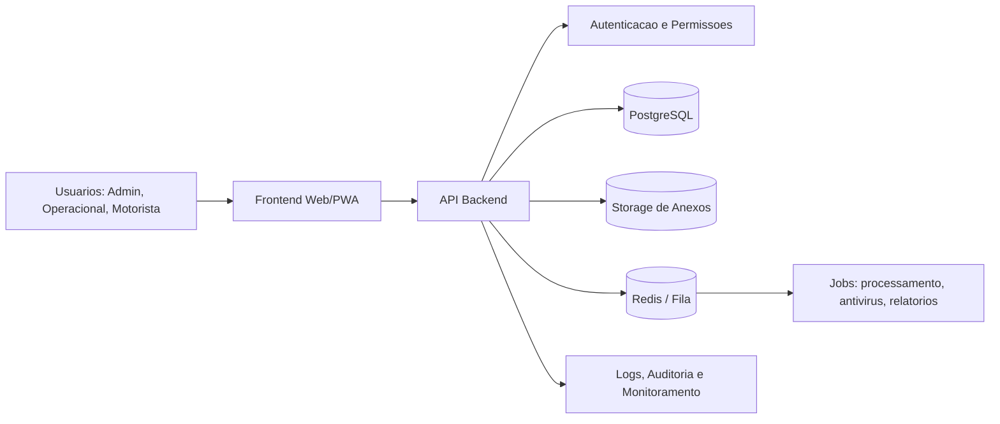

# Proposta tecnica: seguranca, banco de dados, anexos e escalabilidade

Projeto: Sistema de Frota, Pneus, Viagens e Acertos - Executiva Agronegocios

Data: 04/06/2026

## 1. Objetivo

Transformar o sistema atual em uma plataforma segura, escalavel e pronta para uso real por transportadora, com:

- login e credenciais reais;
- permissoes por perfil;
- banco de dados confiavel;
- anexos de documentos e fotos enviados por motoristas;
- historico/auditoria das decisoes;
- arquitetura preparada para crescer sem perder desempenho.

## 2. Situacao atual percebida

O sistema ja tem uma base importante:

- frontend com telas de frota, pneus, viagens, financeiro, relatorios e area do motorista;
- backend Node.js/Express;
- rotas de autenticacao;
- uso de token de sessao;
- PostgreSQL ja iniciado no backend;
- campos de anexos no frontend para lancamentos do motorista e acerto de viagem.

Pontos que ainda precisam evoluir para ambiente profissional:

- dados operacionais ainda dependem bastante de `localStorage` em algumas telas;
- anexos hoje ficam como metadados locais, nao como arquivos armazenados em servidor/storage;
- autenticacao precisa ser endurecida;
- permissoes precisam ser aplicadas no backend, nao apenas na tela;
- precisa haver auditoria de quem aprovou, cancelou, devolveu ou alterou qualquer acerto/lancamento;
- falta armazenamento externo de arquivos;
- falta politica clara de backup, logs, monitoramento e recuperacao.

## 3. Recomendacao principal de tecnologia

### Stack recomendada

| Camada | Recomendacao | Motivo |
|---|---|---|
| Frontend | Manter o atual no curto prazo; evoluir para React + TypeScript ou Next.js no medio prazo | Melhor manutencao, componentes reutilizaveis, validacoes fortes e experiencia mais profissional |
| Backend | Node.js com TypeScript, preferencialmente NestJS ou Fastify; Express pode ficar na fase inicial | API organizada, validacoes, permissoes, testes e manutencao mais segura |
| Banco principal | PostgreSQL gerenciado | Melhor para financeiro, acertos, DRE, frota, pneus, historico e relatorios |
| Arquivos/anexos | Storage S3 compativel: AWS S3, Cloudflare R2, Supabase Storage ou MinIO | Arquivo nao deve ficar dentro do banco; banco guarda apenas metadados |
| Cache/fila | Redis + fila BullMQ ou similar | Processar anexos, gerar relatorios e evitar travar o sistema |
| Hospedagem | VPS profissional, Render/Fly/Railway, AWS, Google Cloud ou Azure | Separar frontend, API, banco e storage |
| Monitoramento | Sentry + logs centralizados + uptime monitor | Detectar erro antes do usuario reclamar |

## 4. Sobre SQL x NoSQL

Existe uma ideia comum de que "SQL nao escala" ou que "NoSQL e mais moderno". Para este sistema, isso nao e verdade como regra.

### Por que PostgreSQL e recomendado como banco principal

O dominio do sistema e altamente relacional:

- motorista pertence a empresa;
- veiculo pertence a frota;
- pneu esta em estoque, rodando, recapado ou baixado;
- viagem tem motorista, veiculo, receitas, despesas, km, status e acerto;
- lancamento do motorista precisa ser aprovado, devolvido ou cancelado;
- DRE depende de receitas, custos, despesas, datas e categorias;
- relatorios precisam cruzar placas, motoristas, pneus, viagens e financeiro.

Esse tipo de regra precisa de consistencia, transacoes e integridade. PostgreSQL e excelente nisso.

### Onde NoSQL pode fazer sentido

NoSQL pode ser usado como complemento, nao como banco principal, em casos como:

- logs de eventos em altissimo volume;
- telemetria de rastreador em tempo real;
- documentos muito variaveis sem relacao forte;
- cache temporario.

Para acerto de viagem, financeiro, auditoria e DRE, usar somente MongoDB/Firebase como base principal tende a dificultar relatorios e controle financeiro.

### Decisao sugerida

Usar PostgreSQL como banco principal e storage S3 para documentos. Se no futuro houver telemetria ou rastreamento em tempo real, adicionar uma camada separada para eventos.

## 5. Arquitetura proposta

## 6. Autenticacao e credenciais

### Perfis sugeridos

| Perfil | Acesso |
|---|---|
| Admin | tudo, incluindo usuarios, permissoes, financeiro e configuracoes |
| Gerente | viagens, financeiro, relatorios, aprovacao de lancamentos |
| Operacional | frota, pneus, manutencao, viagens e aprovacao conforme permissao |
| Financeiro | DRE, receitas, despesas e fechamento |
| Motorista | somente area do motorista, lancamentos, solicitacoes e propria viagem |

### Regras recomendadas

- senha com hash forte: Argon2id ou bcrypt;
- token de acesso curto, por exemplo 15 minutos;
- refresh token em cookie `HttpOnly`, `Secure`, `SameSite`;
- bloqueio apos muitas tentativas de login;
- historico de ultimo login;
- possibilidade de bloquear usuario;
- redefinicao de senha controlada;
- permissao sempre validada no backend;
- motorista nao pode acessar area operacional nem por URL direta.

### Importante

O frontend pode esconder botoes, mas a seguranca real deve estar no backend. Toda rota de API precisa validar:

- quem e o usuario;
- qual empresa/corporacao ele pertence;
- qual perfil ele tem;
- se ele pode fazer aquela acao.

## 7. Anexos de documentos e fotos

O sistema precisa aceitar anexos nos lancamentos do motorista e nos acertos:

- nota fiscal;
- recibo;
- comprovante de pix;
- foto de cupom;
- foto de avaria;
- documento de manutencao;
- comprovante de pedagio;
- comprovante de abastecimento.

### Como deve funcionar

1. Motorista envia lancamento ou solicitacao com arquivo.
2. Backend recebe o arquivo.
3. Arquivo e validado: tamanho, tipo, extensao e seguranca.
4. Arquivo vai para storage S3/R2/Supabase Storage/MinIO.
5. Banco salva apenas metadados:
   - nome original;
   - tipo MIME;
   - tamanho;
   - caminho no storage;
   - usuario que enviou;
   - lancamento/acerto vinculado;
   - data de envio.
6. Escritorio visualiza por link assinado temporario.
7. Escritorio aprova, cancela ou devolve o lancamento.

### Regras de seguranca para anexos

- nunca salvar arquivo diretamente em pasta publica;
- nunca deixar link permanente publico;
- usar URL assinada com expiracao;
- limitar tamanho, por exemplo 10 MB por arquivo;
- aceitar apenas tipos permitidos: PDF, JPG, PNG, WEBP;
- renomear arquivo internamente com UUID;
- registrar auditoria de upload, visualizacao e exclusao;
- opcional: antivirus/scan antes de liberar visualizacao.

## 8. Modelo conceitual de dados

Tabelas principais sugeridas:

| Tabela | Finalidade |
|---|---|
| empresas | empresas/corporacoes do sistema |
| usuarios | login, senha, perfil e status |
| motoristas | cadastro operacional do motorista |
| veiculos | placas, tipo, proprietario, motorista vinculado |
| pneus | cadastro, status, custo, marca, recapagens |
| movimentacoes_pneus | instalacao, retirada, baixa, recapagem, atualizacao |
| viagens | viagem/acerto por motorista e veiculo |
| lancamentos_viagem | despesas, combustivel, solicitacoes e receitas vinculadas ao acerto |
| anexos | metadados dos arquivos enviados |
| aprovacoes | decisoes do escritorio: aprovado, devolvido, cancelado |
| auditoria_eventos | historico de acoes sensiveis |
| categorias_financeiras | combustivel, arla, pedagio, oficina, lavagem etc |

## 9. Fluxo do acerto de viagem com anexos

1. Operacional cria uma viagem/acerto ou abre uma viagem existente.
2. Motorista faz lancamentos pela area dele:
   - combustivel;
   - despesa;
   - solicitacao;
   - anexo do comprovante.
3. Lancamento entra como `pendente`.
4. Escritorio revisa:
   - aprovar: entra no acerto;
   - devolver: volta para motorista corrigir;
   - cancelar: fica registrado, mas nao entra no financeiro.
5. Acerto calcula:
   - receitas;
   - despesas aprovadas;
   - adiantamentos;
   - lucro/prejuizo;
   - km rodado;
   - indicadores.
6. Financeiro usa os dados aprovados na DRE.

## 10. Escalabilidade

### Escala inicial

Para uma transportadora em operacao normal:

- 1 API Node.js;
- 1 PostgreSQL gerenciado;
- 1 storage S3/R2;
- backups diarios;
- logs e monitoramento.

### Escala intermediaria

Quando houver mais usuarios, muitas viagens e muitos anexos:

- API stateless com 2 ou mais instancias;
- Redis para cache, sessoes temporarias e filas;
- jobs para processar anexos e relatorios;
- CDN para arquivos;
- banco com indices e backups automaticos;
- separacao por ambiente: desenvolvimento, homologacao e producao.

### Escala alta

Se o sistema crescer para multiplas empresas e grande volume:

- multi-tenant por empresa/corporacao;
- particionamento por empresa ou data em tabelas grandes;
- replica de leitura para relatorios pesados;
- fila dedicada para importacoes e relatorios;
- storage com ciclo de vida para arquivar documentos antigos;
- auditoria e trilha completa de seguranca.

## 11. Seguranca minima obrigatoria

Checklist:

- HTTPS obrigatorio;
- CORS liberado somente para dominio oficial;
- headers de seguranca com Helmet;
- rate limit no login e endpoints sensiveis;
- senha com hash forte;
- token curto e refresh token seguro;
- validacao de entrada com Zod/Joi;
- permissao no backend por rota;
- logs de auditoria;
- backup automatico;
- variaveis secretas fora do codigo;
- banco sem acesso publico direto;
- storage sem arquivo publico permanente;
- revisao de anexos antes de aprovar;
- controle de tamanho e tipo de arquivo;
- rotina de restore testada.

## 12. Tecnologias opcionais por caminho

### Caminho rapido e profissional

Bom para colocar em producao mais rapido:

- Frontend atual evoluindo gradualmente;
- Backend Node.js/Express com TypeScript;
- PostgreSQL gerenciado;
- Supabase Storage ou Cloudflare R2;
- Redis quando precisar de fila/cache.

### Caminho mais empresarial

Mais robusto e organizado para crescer:

- Frontend Next.js/React + TypeScript;
- Backend NestJS + TypeScript;
- PostgreSQL gerenciado;
- S3/R2 para anexos;
- Redis + BullMQ;
- Docker;
- CI/CD;
- Sentry e logs centralizados.

### Caminho no-code/low-code parcial

Pode acelerar algumas partes, mas limita personalizacao:

- Supabase Auth + Postgres + Storage;
- frontend atual ou React;
- backend proprio apenas para regras mais complexas.

## 13. Fases de implementacao sugeridas

### Fase 1 - Base segura

- revisar backend atual;
- migrar dados criticos do `localStorage` para PostgreSQL;
- autenticar todas as rotas;
- criar permissoes por perfil;
- ajustar token e senha;
- criar auditoria basica.

### Fase 2 - Anexos reais

- implementar upload no backend;
- integrar storage S3/R2/Supabase Storage;
- criar tabela `anexos`;
- salvar metadados no banco;
- gerar link assinado para visualizacao;
- validar tipo/tamanho de arquivo.

### Fase 3 - Acerto profissional

- viagens/acertos no banco;
- lancamentos do motorista no banco;
- fluxo aprovar/devolver/cancelar;
- DRE usando dados aprovados;
- auditoria de cada decisao.

### Fase 4 - Escala e operacao

- Redis/fila;
- relatorios pesados em background;
- backup automatico;
- monitoramento;
- logs centralizados;
- ambiente de homologacao;
- testes automatizados.

## 14. Recomendacao final

Minha recomendacao e nao abandonar SQL. Para este sistema, o melhor caminho e:

1. PostgreSQL como banco principal.
2. Storage S3 compativel para documentos/fotos.
3. Backend Node.js com TypeScript e permissoes fortes.
4. Autenticacao com senha hash, token curto e refresh seguro.
5. Auditoria completa de acoes sensiveis.
6. Redis/fila apenas quando o volume justificar.

Esse conjunto da seguranca, escala e controle financeiro sem complicar o sistema antes da hora.

## 15. Pontos para aprovacao do responsavel tecnico

O responsavel tecnico deve avaliar e aprovar:

- PostgreSQL como banco principal;
- storage externo para anexos;
- modelo de autenticacao;
- perfis de acesso;
- fluxo de aprovacao de lancamentos;
- politica de backup;
- hospedagem preferida;
- limite de tamanho dos anexos;
- se usaremos Express atual ou migraremos para NestJS/TypeScript.

## 16. Decisao sugerida para comecar

Comecar com:

- PostgreSQL gerenciado;
- backend atual endurecido e depois migrado para TypeScript;
- storage Cloudflare R2 ou Supabase Storage;
- autenticacao com token seguro;
- anexos vinculados a lancamentos/acertos;
- auditoria de aprovacoes.

Depois de aprovado, o proximo passo e transformar esta proposta em plano tecnico de implementacao com tarefas, tabelas, endpoints e ordem de entrega.
